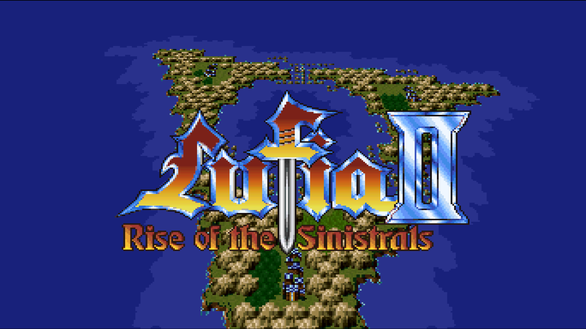
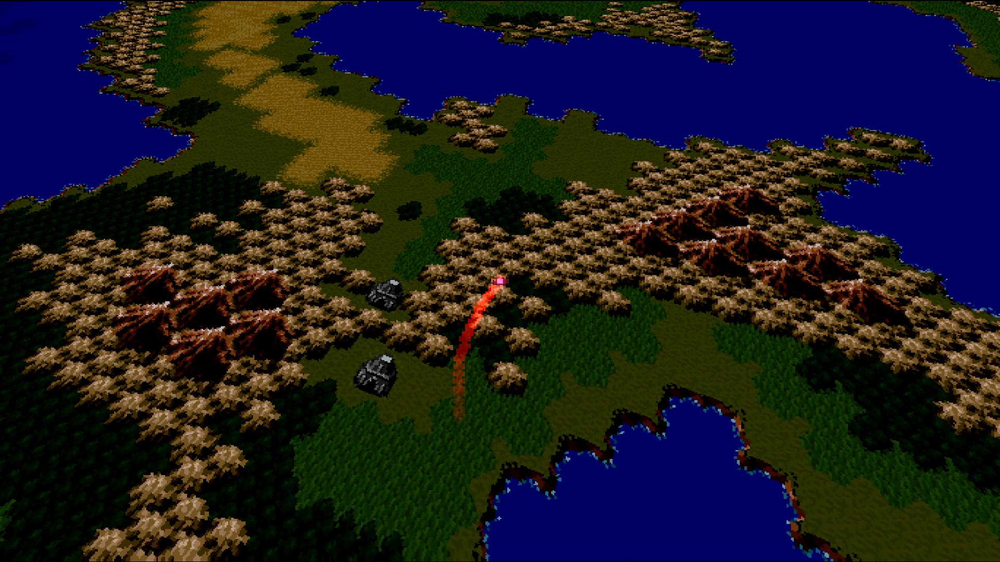
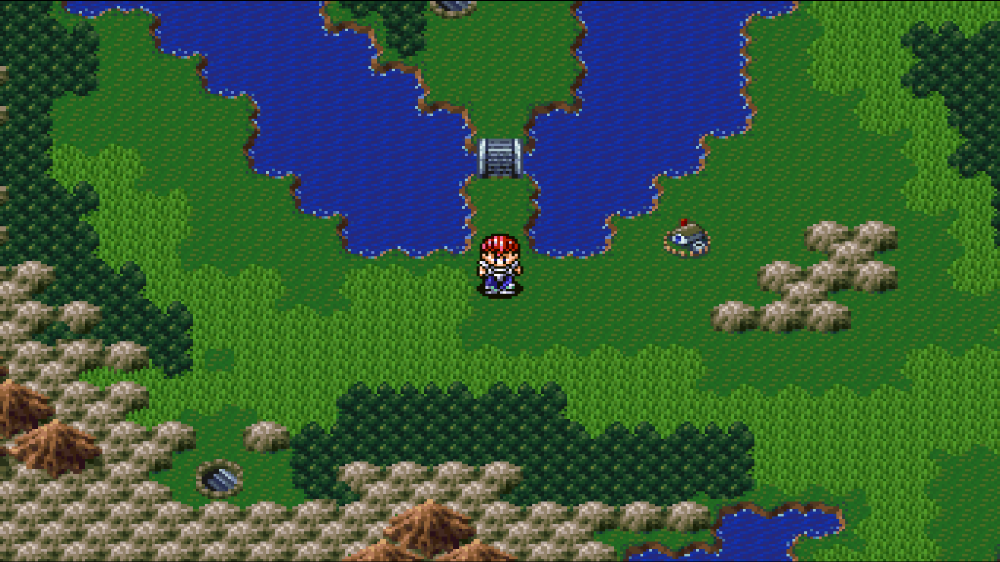
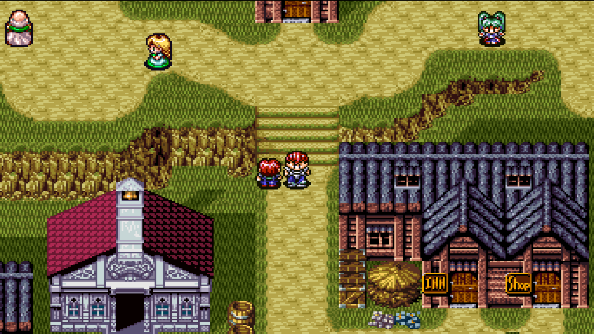
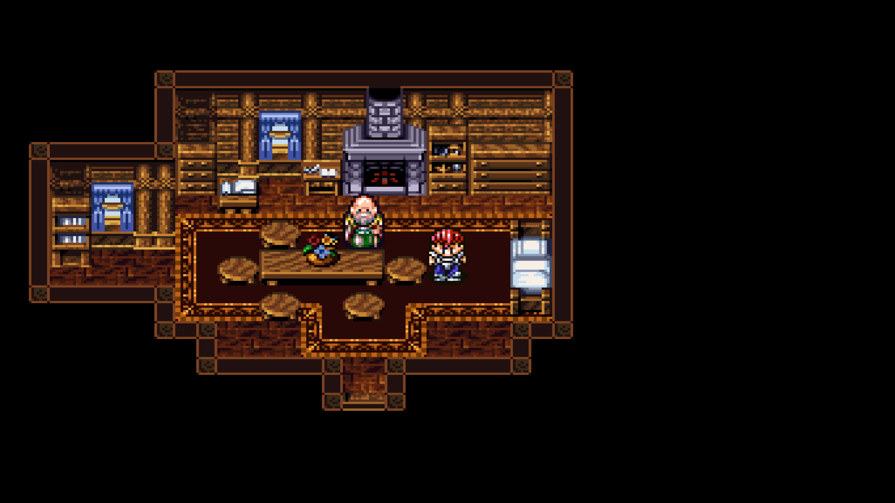
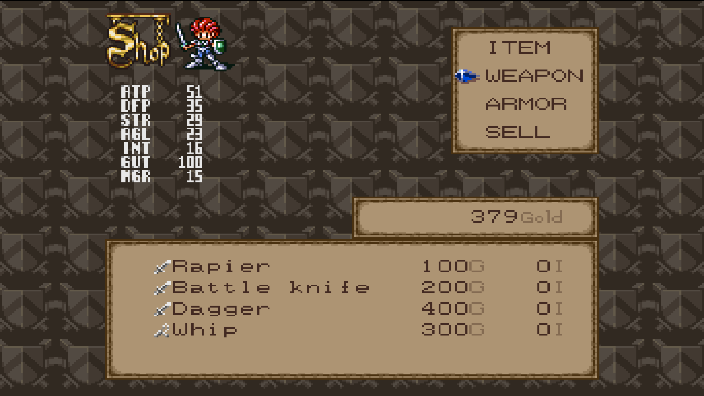
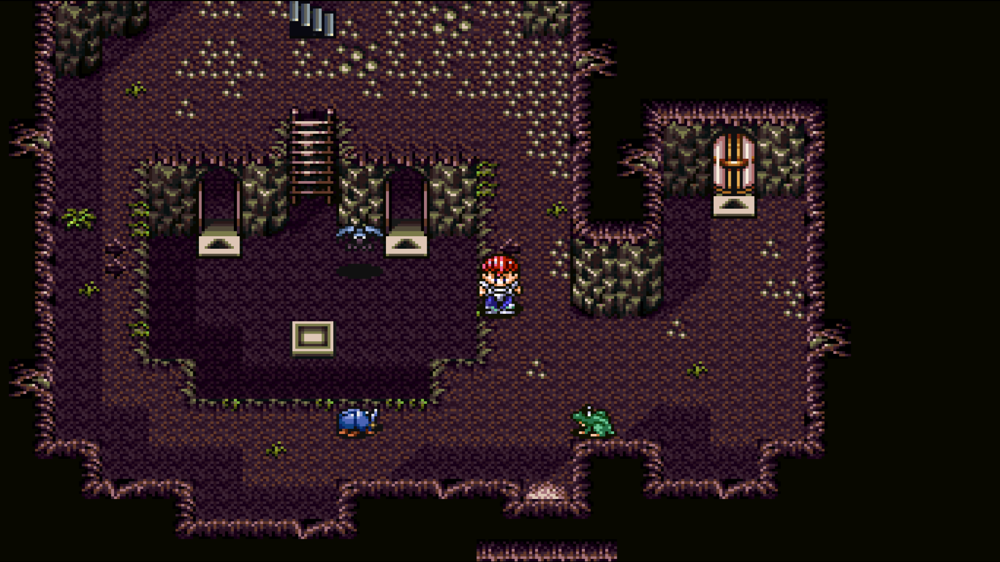
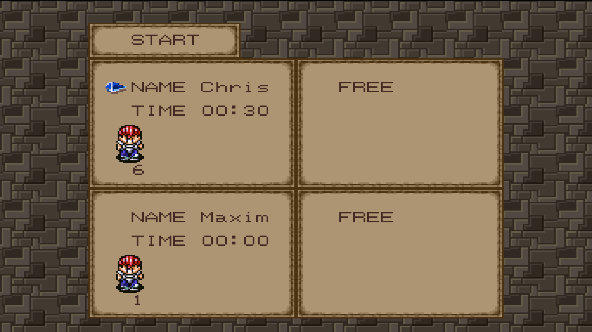

# Lufia II Recompiled

A native recompilation of **Lufia II: Rise of the Sinistrals** using
[`snesrecomp`](https://github.com/mstan/snesrecomp).

The game boots from the original US ROM and supports the intro, title screen,
normal gameplay, battles, audio, input, saves and the desktop launcher. Video
output can use SDL or OpenGL 3.3.

<p align="center">
  
  <br><sub><b>Title screen</b></sub>
</p>

<p align="center">
  
  <br><sub><b>Mode 7 intro flyover</b></sub>
</p>

<table>
  <tr>
    <td width="33%"><br><sub><b>Overworld</b></sub></td>
    <td width="34%"><br><sub><b>Town</b></sub></td>
    <td width="33%"><br><sub><b>Interior</b></sub></td>
  </tr>
  <tr>
    <td><br><sub><b>Shop</b></sub></td>
    <td><br><sub><b>Dungeon</b></sub></td>
    <td><br><sub><b>Save selection</b></sub></td>
  </tr>
</table>

## ROM

The ROM is not included. Use the clean, headerless US release:

```text
Size:   2621440 bytes
SHA1:   A89931C1F29B161B8BE717DFAB4A4ADB54B42B84
SHA256: 7C34ECB16C10F551120ED7B86CFBC947042F479B52EE74BB3C40E92FDD192B3A
```

Place it in the repository root as `lufia2.sfc`.

## Build

### Windows

Requirements:

- Windows 10 or later
- Visual Studio 2022 with Desktop development with C++
- CMake 3.24 or later
- Python 3

Build from the command line:

```powershell
git submodule update --init --recursive
cmake --preset windows-release
cmake --build --preset windows-release
```

The executable is written to:

```text
build\windows\Release\Lufia2Recomp.exe
```

You can also open `lufia2.sln` and build the Release configuration in Visual
Studio.

### Linux (including the Steam Deck)

Requirements: CMake 3.24 or later, Python 3, GCC or Clang, and the SDL3 build
dependencies. On Debian or Ubuntu:

```bash
sudo apt install build-essential cmake ninja-build pkg-config python3 \
  libgl1-mesa-dev libegl1-mesa-dev libx11-dev libxext-dev libxrandr-dev \
  libxcursor-dev libxfixes-dev libxi-dev libxss-dev libxkbcommon-dev \
  libwayland-dev wayland-protocols libdecor-0-dev libdrm-dev libgbm-dev \
  libasound2-dev libpulse-dev libudev-dev libdbus-1-dev
```

```bash
git submodule update --init --recursive
cmake -S . -B build/linux -G Ninja -DCMAKE_BUILD_TYPE=Release
cmake --build build/linux --parallel
```

The executable is written to `build/linux/Lufia2Recomp`, with `libSDL3.so.0`
staged beside it and an `$ORIGIN` runpath, so the directory can be copied to a
Steam Deck as it is. SteamOS is immutable: build elsewhere and copy it over,
keeping the target glibc no older than the build machine's.

### Build options

Everything experimental or diagnostic is off by default, so a normal build is
silent and carries no measurement code. The native patches themselves are
production code and are always built; only their instrumentation switches:

| Option | Adds |
|---|---|
| `LUFIA2_ENABLE_RUNTIME_LOG` | map, MSU, widescreen and periodic state tracing |
| `LUFIA2_ENABLE_PATCH_REPORTING` | patch counters and scheduler time every 120 boundaries |
| `LUFIA2_ENABLE_PATCH_TESTS` | the contract selftests and their command-line entries |
| `LUFIA2_ENABLE_PERF_AUDIT` | the finite Vita performance audit |

Errors are always reported.

## Run

Start `Lufia2Recomp.exe` to open the launcher, or pass a ROM directly:

```powershell
.\build\windows\Release\Lufia2Recomp.exe "D:\ROMs\lufia2.sfc"
```

On Linux it is `./Lufia2Recomp` in the build directory, same arguments.

Save data is stored in `saves\save.srm` next to the executable.

## Repository

- `recomp/` contains the control-flow information used during recompilation.
- `src/` contains the game host and runtime code.
- `lib/snesrecomp-platform/` is the shared renderer and host submodule.

## Renderer

The launcher offers SDL accelerated, SDL software and OpenGL 3.3. OpenGL can
also use GLSL shader presets. If it cannot start, the game falls back to SDL for
that run.

FPS, volume, toast and rewind overlays are composited after the game and its
shaders. The default Lufia skin uses the game's logical coordinate space: one
UI texture pixel receives the same aspect, resize, fullscreen, and letterbox
transform as one SNES pixel while remaining a separate overlay.
`SNESRECOMP_UI_SCALE=0.5..3.0` applies an optional user multiplier (rounded to
whole game pixels in this mode). The game-owned skin in
`src/lufia2_overlay_ui.c` supplies a replaceable bitmap font, nine-slice panel
texture, colours and spacing; the shared presenter remains game-neutral.

An optional external panel override can be placed beside the executable as
`assets/img/lufia2_menu_panel.tga`. Put `left top right bottom tile`
source-pixel margins in the adjacent `lufia2_menu_panel.9slice`; `tile` makes
patterned edges repeat like the original SNES tilemap instead of stretching.
Missing or invalid TGA files fall through to the authentic panel reconstructed
in memory from the verified ROM. The embedded neutral skin remains the final
fallback if that defensive extraction fails. No reconstructed pixels are
written to disk and no panel image ships with the project.

`scripts/ui_asset_tool.py` crops PNG/BMP/TGA screenshots, applies integer
nearest-neighbour downscaling, losslessly compacts tiled panels, writes the
runtime TGA, and renders a tiled or stretched 9-slice preview. It requires
Pillow (`python -m pip install Pillow`). Example for the native 120x88 panel:

```powershell
python scripts/ui_asset_tool.py panel.png `
  build/windows/Debug/assets/img/lufia2_menu_panel.tga `
  --slice 16 16 16 16 --tile 16x16 --compact --preview 240x88
```

The 48x48 result contains both 16-pixel corner regions and one 16x16 repeat
cell. It recreates the original patterned edges without scaling them.

Rewind preview cells are copied pixel-for-pixel from the rewind core. The
Lufia skin never downsizes them again; the moving filmstrip shows three cells
in a 256-pixel 4:3 frame and four in the standard widescreen frame. Only the
surrounding tiled panel and labels are rebuilt for the available width.

Single-line status badges such as the FPS counter use a compact form of the
same panel: a four-pixel border around a tiled clean centre. This permits a
16-pixel logical height without shrinking the font or stretching the artwork.
While rewind is visible, the FPS badge shares its exact right-hand edge.

See [ISSUES.md](ISSUES.md) for the current limitations.
